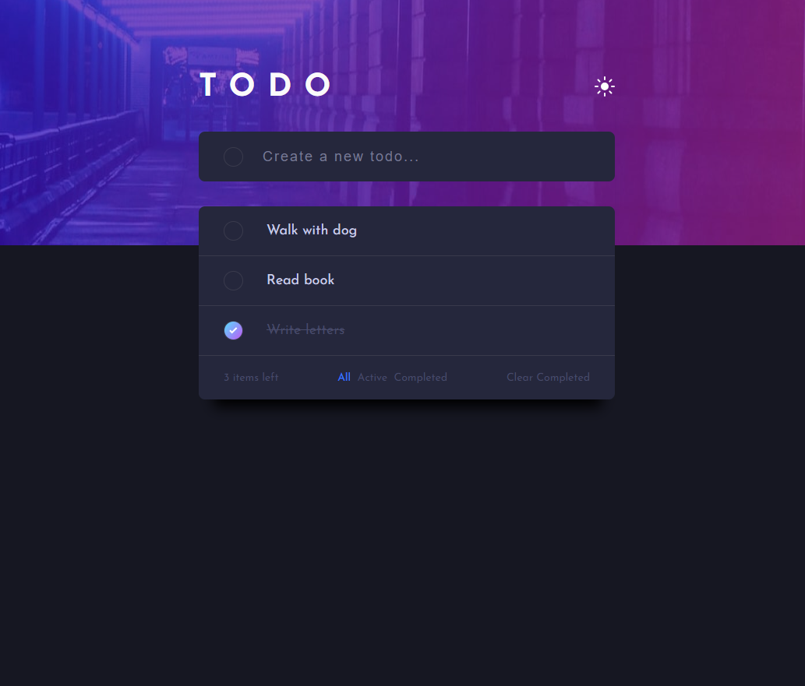

# Frontend Mentor - Todo app solution

This is a solution to the [Todo app challenge on Frontend Mentor](https://www.frontendmentor.io/challenges/todo-app-Su1_KokOW).

## Overview

### The challenge

Users should be able to:

- View the optimal layout for the app depending on their device's screen size
- See hover states for all interactive elements on the page
- Add new todos to the list
- Mark todos as complete
- Delete todos from the list
- Filter by all/active/complete todos
- Clear all completed todos
- Toggle light and dark mode

### Screenshot

### Links

- Solution URL: [Add solution URL here](https://github.com/InnaTymoshenko/todo-app)
- Live Site URL: [Add live site URL here](https://todo-app-six-theta-28.vercel.app/)

## My process

### Built with

- Semantic HTML5 markup
- CSS custom properties
- Flexbox
- Mobile-first workflow
- [React](https://reactjs.org/) - JS library
- Typescript

## Author

- Website - [Tymoshenko Inna](https://itymoshenko.vercel.app/)
- Frontend Mentor - [@InnaTymoshenko](https://www.frontendmentor.io/profile/InnaTymoshenko)
